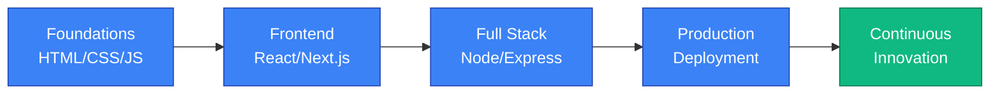

<!-- Header Banner -->
<div align="center">
  <picture>
    <source media="(prefers-color-scheme: dark)" srcset="https://readme-typing-svg.demolab.com?font=Poppins&weight=700&size=42&duration=4000&pause=1000&color=3B82F6&center=true&vCenter=true&width=900&height=100&lines=Full+Stack+Developer;Crafting+digital+experiences;Building+scalable+solutions">
    
  </picture>
</div>

<div align="center">
  
  
  
</div>

---

## 👋 About Me

I'm a **Full Stack Developer** passionate about building elegant, performant, and user-centric web applications. With expertise spanning frontend architecture and backend systems, I focus on writing clean, maintainable code that scales.

**What drives me:**
- 🎯 Solving complex problems with simple, elegant solutions
- 🚀 Building products that create real impact
- 📚 Continuous learning and staying ahead of tech trends
- 🤝 Collaborating with talented teams to ship great software

---

## 🛠️ Tech Stack

### Frontend


### Backend


### Tools & Platforms


---

## 📊 GitHub Statistics

<div align="center">
  <picture>
    <source media="(prefers-color-scheme: dark)" srcset="https://github-readme-stats.vercel.app/api?username=Ayushkumar-13&show_icons=true&theme=nord&hide_border=true&card_width=500&include_all_commits=true">
    
  </picture>
</div>

<div align="center">
  <picture>
    <source media="(prefers-color-scheme: dark)" srcset="https://github-readme-streak-stats.herokuapp.com?user=Ayushkumar-13&theme=nord&hide_border=true">
    
  </picture>
</div>

<div align="center">
  <picture>
    <source media="(prefers-color-scheme: dark)" srcset="https://github-readme-stats.vercel.app/api/top-langs/?username=Ayushkumar-13&layout=compact&theme=nord&hide_border=true&langs_count=8">
    
  </picture>
</div>

---

## 🌟 Featured Projects

### 💼 SkillPath AI - AI-Powered Learning Platform
A comprehensive learning platform leveraging AI to personalize skill development paths for users.

**Key Features:**
- 🤖 AI-driven course recommendations
- 📊 Progress tracking & analytics
- 🎯 Personalized learning paths
- 💾 Persistent user data management

**Tech Stack:** JavaScript, React, Next.js, Node.js, Express  
**[View Repository](https://github.com/Ayushkumar-13/Minor-Project-SkillPath-AI-)**

---

### 🛍️ UrbanNest - E-Commerce Platform
Full-featured e-commerce application with product catalog, shopping cart, and checkout system.

**Key Features:**
- 🛒 Dynamic product management
- 🔍 Advanced search & filtering
- 💳 Secure checkout process
- 👤 User authentication & profile management

**Tech Stack:** JavaScript, React, Node.js, Express  
**[View Repository](https://github.com/Ayushkumar-13/E-Commerce-UrbanNest)** | **[Live Demo](https://github.com/Ayushkumar-13/E-Commerce-UrbanNest)**

---

### 🎓 College Hub - Educational Resource Management
Platform for centralized access to college resources, materials, and information.

**Key Features:**
- 📚 Resource aggregation
- 🔗 Easy navigation
- 📱 Responsive design
- 🔐 Secure access control

**Tech Stack:** JavaScript, React, HTML5, CSS3  
**[View Repository](https://github.com/Ayushkumar-13/College-hub)**

---

## 🎯 Core Competencies

```
Frontend Development          █████████████████░░ 90%
React & Next.js Ecosystem    █████████████████░░ 90%
Backend Development          █████████████░░░░░░ 75%
Responsive Web Design        █████████████████░░ 90%
API Development & Integration █████████████░░░░░░ 80%
Problem Solving              █████████████████░░ 85%
```

---

## 🚀 Current Focus

- 🔍 Deepening expertise in **performance optimization** and **scalable architecture**
- 🎨 Mastering **modern UI/UX design patterns** and **accessibility standards**
- ⚙️ Expanding skills in **backend systems** and **database design**
- 🔐 Building secure, production-ready applications

---

## 📈 Development Journey



---

## 💡 Recent Projects & Experiments

<table>
  <tr>
    <td width="50%">
      <h4>🎮 Interactive Games</h4>
      <p>Quiz Application, Minesweeper, Connect 4</p>
      <p><strong>Skills:</strong> DOM manipulation, Game logic, Event handling</p>
    </td>
    <td width="50%">
      <h4>🌤️ Utility Applications</h4>
      <p>Weather App, Password Generator, Habit Tracker</p>
      <p><strong>Skills:</strong> API integration, State management, Data persistence</p>
    </td>
  </tr>
  <tr>
    <td width="50%">
      <h4>🎫 Event Management</h4>
      <p>Event Ticket Booking System</p>
      <p><strong>Skills:</strong> Complex state, User flows, Booking logic</p>
    </td>
    <td width="50%">
      <h4>💬 AI Integration</h4>
      <p>Interactive Chatbot</p>
      <p><strong>Skills:</strong> API integration, Real-time communication, UX design</p>
    </td>
  </tr>
</table>

---

## 🏆 Achievements & Recognition

- ✅ Built and deployed **10+ production-ready applications**
- ✅ Mastered **modern JavaScript frameworks** and **web technologies**
- ✅ Strong foundation in **full-stack development** principles
- ✅ Demonstrated ability to **deliver polished, user-friendly applications**

---

## 🔗 Connect & Collaborate

<div align="center">

[](https://linkedin.com)
[](https://github.com/Ayushkumar-13)
[](mailto:your.email@example.com)
[](https://your-portfolio.com)

</div>

---

## 📝 Let's Build Something Great!

I'm always interested in:
- 🤝 Collaborating on impactful projects
- 💼 Discussing interesting technical challenges
- 📖 Contributing to open-source
- 🎯 Exploring new technologies and methodologies

**Feel free to reach out!** Let's connect and create something amazing together.

---

<div align="center">
  
**Made with ❤️ by Ayush Kumar**


</div>